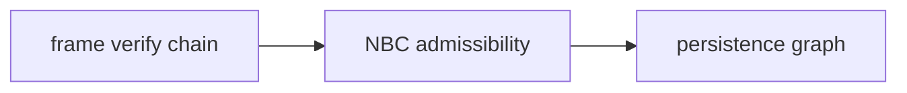
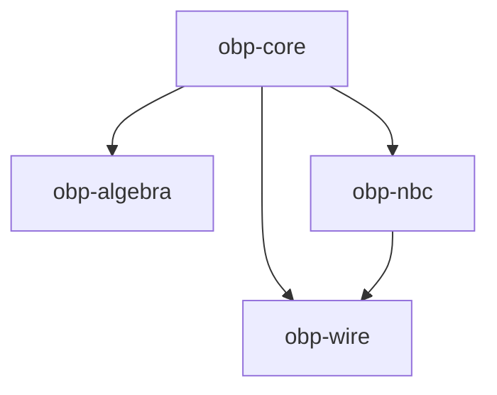

# OBP layering

How protocol namespaces, npm packages, and runtime projection relate.

## Protocol layers

| Layer | Smithy | Package | What it defines |
|-------|--------|---------|-----------------|
| Graph | `khora.obp` | `@khoralabs/obp-core` | Party, Offer, Port shapes; EXTENDS / EXPOSES / BINDS edges; persistence API |
| Convention | `khora.obp.nbc` | `@khoralabs/obp-nbc` | When a bind is admissible: expiry windows, `max_bindings`, bind-payload validation (N1–N9) |
| Transport | `khora.obp.frame`, `khora.obp.session` | `@khoralabs/obp-wire` | Signed Frame DAG, session Merkle log, HTTP/2 and WebSocket bindings |
| Interface ops | — | `@khoralabs/obp-algebra` | Port-set composition, atoms, Merkle library commitments (optional; core-only dep) |

**Graph** shapes are thin: NBC timing and capacity live in NBC projections (`nbc_expires_*`), not on core `Offer` / `Port` types.

**NBC** is additive. An OBP-conformant persistence store may omit NBC bind-admissibility enforcement. NBC-conformant deployments satisfy NBC in addition to graph rules. See `docs/spec/persistence/persistence.smithy`.

**Wire** verifies frame chains and applies NBC turns before projecting into persistence. `Frame.body` is opaque at the frame layer; NBC semantics live inside accepted TURN payloads.

**Algebra** is optional and independent of negotiation. Hosts use it to compute port boundaries or prove library membership before or beside NBC.

## Runtime projection

When NBC and wire are in use, accepted effects flow:

1. **Frame** — verify `p_hash` chain and signatures
2. **NBC** — evaluate bind windows, capacity, payload schema (if NBC is enabled)
3. **Graph** — project EXTENDS / EXPOSES / BINDS into `ObpPersistence`

## npm package dependencies

- `obp-core` has no dependency on nbc or wire at runtime. NBC expose-time validation is injected via optional `validateBindPolicyAtExpose` callback.
- `obp-wire` depends on `obp-core` and `obp-nbc` (turn types, HLC hooks).
- `obp-algebra` depends on `obp-core` only.

## Smithy namespaces ↔ packages

| Spec directory | Namespace | Package |
|----------------|-----------|---------|
| `docs/spec/model/` | `khora.obp` | `@khoralabs/obp-core` |
| `docs/spec/persistence/` | `khora.obp.persistence` | `@khoralabs/obp-core` (`./persistence`, `./sqlite`) |
| `docs/spec/nbc/` | `khora.obp.nbc` | `@khoralabs/obp-nbc` |
| `docs/spec/frame/` | `khora.obp.frame` | `@khoralabs/obp-wire` |
| `docs/spec/session/` | `khora.obp.session` | `@khoralabs/obp-wire` |
| `docs/spec/transport/` | `khora.obp.frame.http2`, etc. | `@khoralabs/obp-wire` (`./http2`, `./ws`) |

Validate order (`docs/spec/validate.sh`): `model → persistence → nbc`; `model → frame → session`; `frame → transport`.

## Related docs

| Topic | Doc |
|-------|-----|
| Graph ontology | [overview.md](./overview.md) |
| `compose`, atoms, commitments | [algebra.md](./algebra.md) |
| HLC peer time (NBC N1) | [peer-time.md](./peer-time.md) |
| MLS / transport confidentiality | [transport-confidentiality.md](./transport-confidentiality.md) |
| Normative Smithy | [../spec/](../README.md#spec) |
