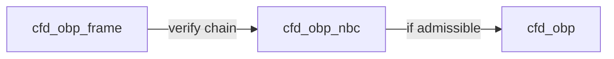
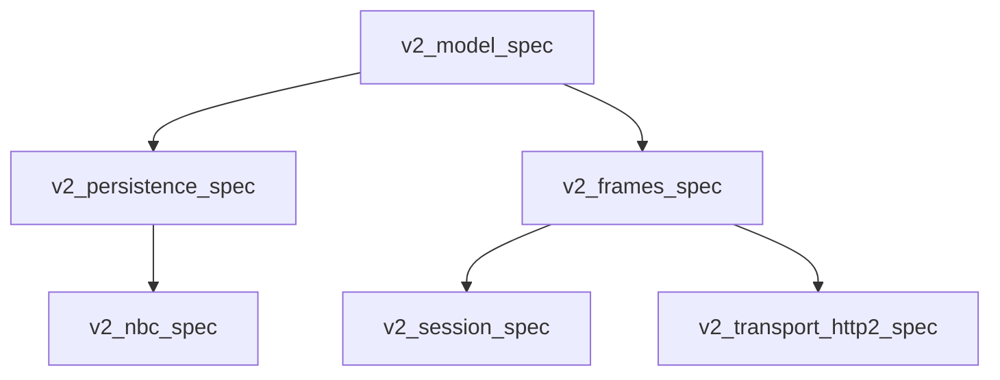

# OBP

## Layering (OBP vs NBC vs frames)

- **`khora.obp`:** Peer **DAG** — parties, offers, **ports as affordances** (identity, ref, promise, type), **BINDS** as the bind-with-offer verb (**`BindsEdge`** is graph identity only). Policy payloads use **`khora.obp.nbc`** shapes and **`ObpPersistence`** **`Document`** fields on bind operations / listings—not fields on **`BindsEdge`**.
- **`khora.obp.nbc`:** **When** a bind is allowed; **`NbcPortExposePolicy`**, **`NbcBindSatisfaction`**, **`NbcRowCommitMeta`** (`packages/obp/v2/nbc/spec/model/nbc-policy.smithy`); **NegotiatedBindingConvention** rules **N1–N9**.
- **`khora.obp.frame`:** Signed **Frame** DAG + **`SessionInit`**; **`Frame.body`** is **opaque** JSON for **TURN** / **END_OFFERS** / **TERMINATE** — no normative `TurnBody` / `PortSpec` wire shapes in v2.



## Modules

| Directory | Role | Primary Smithy |
|-----------|------|------------------|
| `model/spec` | Graph vocabulary (`Party`, `Offer`, **thin** `Port`, edges, …) | `model/shapes.smithy` |
| `persistence/spec` | `ObpPersistence` service + ops | `model/persistence.smithy` |
| `nbc/spec` | NBC rules + policy shapes | `model/negotiated-binding-convention.smithy`, `model/nbc-policy.smithy` |
| `frames/spec` | Frame DAG, opaque `body` | `model/frame-protocol.smithy` |
| `session/spec` | Decentralized session | `model/session-protocol.smithy` |
| `transport-http2/spec` | HTTP/2 reference binding | `model/frame-binding-http2.smithy` |

## Canonical namespaces

| Folder | Namespace(s) |
|--------|----------------|
| `model/` | `khora.obp` |
| `persistence/` | `khora.obp` (extends the same aggregate via multi-root `sources`) |
| `nbc/` | `khora.obp.nbc` |
| `frames/` | `khora.obp.frame` |
| `session/` | `khora.obp.session` |
| `transport-http2/` | `khora.obp.frame.http2` |

## Validate

From the repo root, either run all packages in order:

```sh
bash packages/obp/v2/validate-all.sh
```

Or per package (working directory is `…/spec`):

```sh
smithy validate model && smithy build
```

Each `*/spec/smithy-build.json` lists **relative** `sources` (paths ascend to `v2/` then into sibling packages, e.g. `../../model/spec/model`) so downstream builds compose model + local files **without** duplicating shapes in the same namespace.

## Additive vs cutover

- **Until cutover:** run `smithy validate` only **per** `v2/*/spec` package. Do **not** merge [`packages/obp/persistence/spec`](../persistence/spec) model sources with `v2/**` in a single Smithy build, or you will get duplicate definitions for the same namespace.
- **After cutover:** retire or shrink the monolithic spec tree and point CI at these packages; TypeScript can follow the same boundaries.

## Composition (dependency order)



## npm package names

Private workspace-style names: `@khoralabs/obp-model-spec`, `@khoralabs/obp-persistence-spec`, `@khoralabs/obp-nbc-spec`, `@khoralabs/obp-frames-spec`, `@khoralabs/obp-session-spec`, `@khoralabs/obp-transport-http2-spec`.
