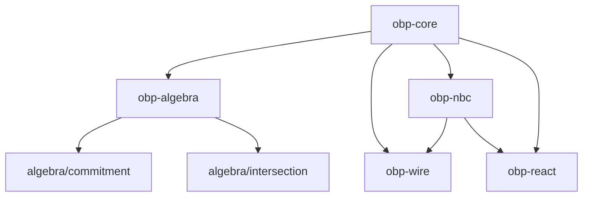

# OBP — packages

Implementation packages. Protocol theory and Smithy live under [`docs/`](../docs/README.md).

| Directory | Package | Role |
|-----------|---------|------|
| `core/` | `@khoralabs/obp-core` | Errors, primitives, model, byte-stream; `./persistence`, `./sqlite` |
| `algebra/` | `@khoralabs/obp-algebra` | Wiring calculus, port atoms, commitments; `./interface`, `./atom`, `./commitment`, `./intersection` |
| `nbc/` | `@khoralabs/obp-nbc` | NBC rules (TS), Standard Schema turn profiles, snapshot helpers; `./bind-policy` |
| `wire/` | `@khoralabs/obp-wire` | Frame + session; `./http2`, `./ws` |
| `react/` | `@khoralabs/obp-react` | NBC chain visualization |

Algebra is **interface geometry** (optional). NBC is **bind admissibility** (optional). Wire is **signed transport**. See [`docs/theory/algebra.md`](../docs/theory/algebra.md).

Validate specs: `bash docs/spec/validate.sh`
