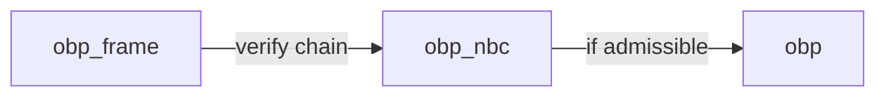
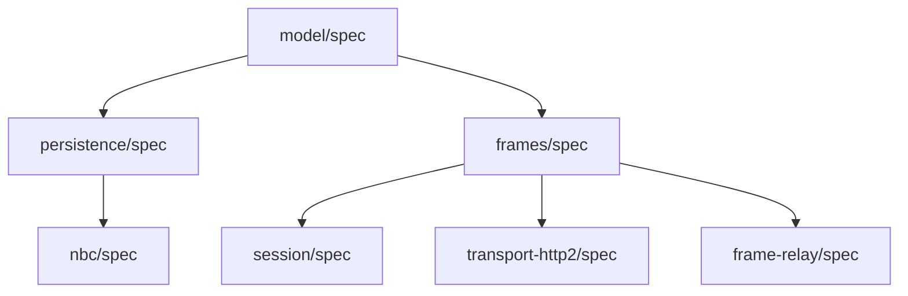

# OBP — packages

## Protocol layering

- **`khora.obp`:** Peer **DAG** — parties, offers, **ports as affordances** (identity, ref, promise, type), **BINDS** as the bind-with-offer verb (**`BindsEdge`** is graph identity only). Policy payloads use **`khora.obp.nbc`** shapes and **`ObpPersistence`** **`Document`** fields on bind operations / listings — not fields on **`BindsEdge`**.
- **`khora.obp.nbc`:** **When** a bind is allowed; **`NbcPortExposePolicy`**, **`NbcBindSatisfaction`**, **`NbcRowCommitMeta`** (`nbc/spec/model/nbc-policy.smithy`); **NegotiatedBindingConvention** rules **N1–N9**.
- **`khora.obp.frame`:** Signed **Frame** DAG + **`SessionInit`**; **`Frame.body`** is **opaque** JSON for **TURN** / **END_OFFERS** / **TERMINATE** — no normative `TurnBody` / `PortSpec` wire shapes.



## Modules

| Directory | Package | Role | Primary Smithy |
|-----------|---------|------|----------------|
| `model/spec` | `@khoralabs/obp-model-spec` | Graph vocabulary (`Party`, `Offer`, thin `Port`, edges) | `model/shapes.smithy` |
| `model/impl/ts` | `@khoralabs/obp-model` | TypeScript types for `khora.obp` | — |
| `persistence/spec` | `@khoralabs/obp-persistence-spec` | `ObpPersistence` service + ops | `model/persistence.smithy` |
| `persistence/impl/ts` | `@khoralabs/obp-persistence` | Strategy adapter + client | — |
| `persistence/sqlite` | `@khoralabs/obp-sqlite-persistence` | SQLite reference strategy | — |
| `nbc/spec` | `@khoralabs/obp-nbc-spec` | NBC rules + policy shapes | `model/negotiated-binding-convention.smithy`, `model/nbc-policy.smithy` |
| `nbc/impl/ts` | `@khoralabs/obp-nbc` | Bind-time checks, `applyNbcTurn`, session helpers | — |
| `bind-policy` | `@khoralabs/nbc-bind-policy` | JSON Schema + AJV validation; `stableStringify` for schema cache keys | — |
| `obp-primitives` | `@khoralabs/obp-primitives` | Hex encoding, SHA-256 helpers, `Sha256HexLower` | — |
| `frames/spec` | `@khoralabs/obp-frames-spec` | Frame DAG, opaque `body` | `model/frame-protocol.smithy` |
| `frames/impl/ts` | `@khoralabs/obp-frames-impl` | Wire types, canonical JSON, signing, framing | — |
| `session/spec` | `@khoralabs/obp-session-spec` | Decentralized session | `model/session-protocol.smithy` |
| `session/impl/ts` | `@khoralabs/obp-session-impl` | Merkle checkpoints, envelope verification | — |
| `transport-http2/spec` | `@khoralabs/obp-transport-http2-spec` | HTTP/2 reference binding | `model/frame-binding-http2.smithy` |
| `transport-http2/impl/ts` | `@khoralabs/obp-transport-http2` | HTTP/2 transport | — |
| `transport-ws/impl/ts` | `@khoralabs/obp-transport-ws` | WebSocket transport | — |
| `frame-relay/spec` | `@khoralabs/obp-frame-relay-spec` | `RelayEnvelope` + `FrameRelayStore` service | `model/hub-protocol.smithy` |
| `frame-relay/impl/ts` | `@khoralabs/obp-frame-relay` | Hub runtime, store strategy port, Bun WS helpers | — |
| `frame-relay/sqlite` | `@khoralabs/obp-frame-relay-sqlite` | SQLite `FrameRelayStoreStrategy` | — |
| `duplex-byte-stream` | `@khoralabs/duplex-byte-stream` | `DuplexByteStream` interface, channel admission tickets | — |
| `react` | `@khoralabs/obp-react` | React NBC chain visualization (XYFlow) | — |
| `errors/impl/ts` | `@khoralabs/obp-errors` | Shared `ObpError` / `ObpErrorCode` | — |

## Canonical namespaces

| Folder | Namespace |
|--------|-----------|
| `model/` | `khora.obp` |
| `persistence/` | `khora.obp` (multi-root sources extending the model aggregate) |
| `nbc/` | `khora.obp.nbc` |
| `frames/` | `khora.obp.frame` |
| `session/` | `khora.obp.session` |
| `transport-http2/` | `khora.obp.frame.http2` |

## Validate Smithy specs

From the repo root, run all packages in dependency order:

```sh
bash packages/validate-all.sh
```

Or per package (working directory is the `spec/` folder):

```sh
smithy validate model && smithy build
```

Each `*/spec/smithy-build.json` lists **relative** `sources` so downstream builds compose model + local files without duplicating shapes in the same namespace.

## Spec dependency graph


