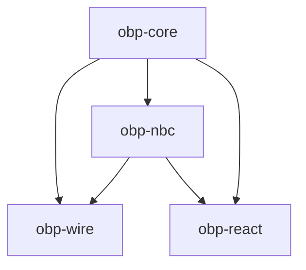

# OBP — packages

Implementation packages. Protocol theory and Smithy live under [`docs/`](../docs/README.md).

| Directory | Package | Role |
|-----------|---------|------|
| `core/` | `@khoralabs/obp-core` | Errors, primitives, model, byte-stream; `./persistence`, `./sqlite` |
| `nbc/` | `@khoralabs/obp-nbc` | NBC rules (TS), Standard Schema turn profiles, snapshot helpers; `./bind-policy` |
| `wire/` | `@khoralabs/obp-wire` | Frame + session; `./http2`, `./ws` |
| `react/` | `@khoralabs/obp-react` | NBC chain visualization |

Validate specs: `bash docs/spec/validate.sh`
