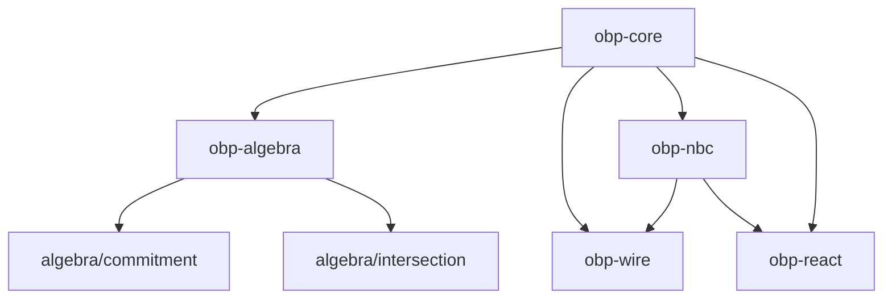

# OBP — packages

Implementation packages. Protocol theory and Smithy live under [`docs/`](../docs/README.md).

| Directory | Package | Role |
|-----------|---------|------|
| `core/` | `@khoralabs/obp-core` | Errors, primitives, model, byte-stream; `./persistence`, `./sqlite` |
| `algebra/` | `@khoralabs/obp-algebra` | `compose`, `parallel`, `hide`, `rename`, `choice`, port atoms, Merkle commitments; `./interface`, `./atom`, `./commitment`, `./intersection` |
| `nbc/` | `@khoralabs/obp-nbc` | NBC bind rules (TypeScript), Standard Schema turn profiles; `./bind-policy` |
| `wire/` | `@khoralabs/obp-wire` | Frame + session; `./http2`, `./ws` |
| `react/` | `@khoralabs/obp-react` | NBC chain visualization |

- **core** — graph types and persistence
- **algebra** — optional port-set operations and library commitments (depends on core only)
- **nbc** — when a bind is admissible during negotiation (depends on core)
- **wire** — signed frame/session transport (depends on core + nbc)
- **react** — optional UI for NBC chain graphs

See [`docs/theory/algebra.md`](../docs/theory/algebra.md) and [`docs/theory/layering.md`](../docs/theory/layering.md).

Validate specs: `bash docs/spec/validate.sh`
